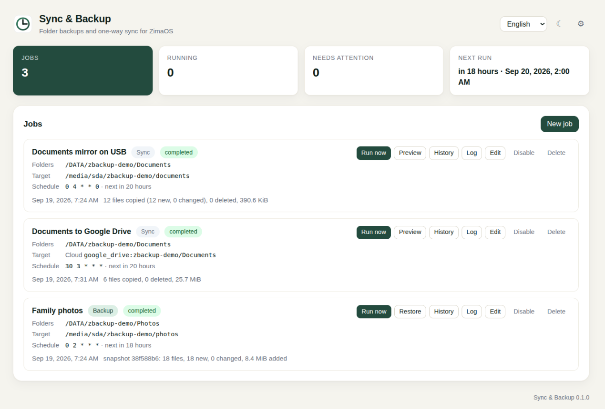
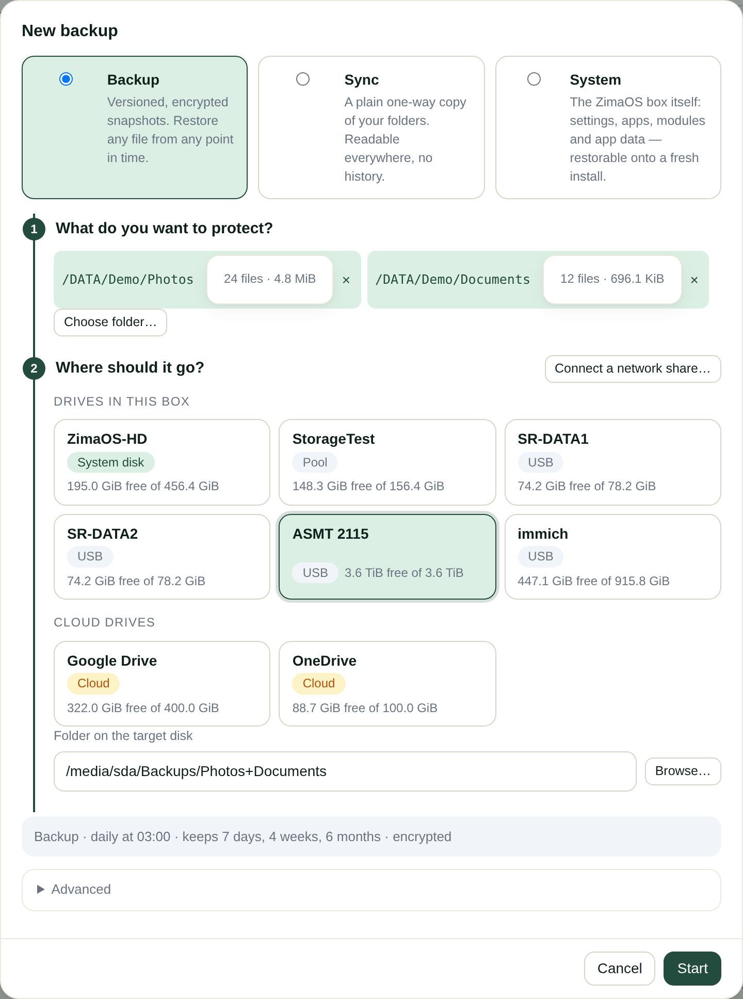
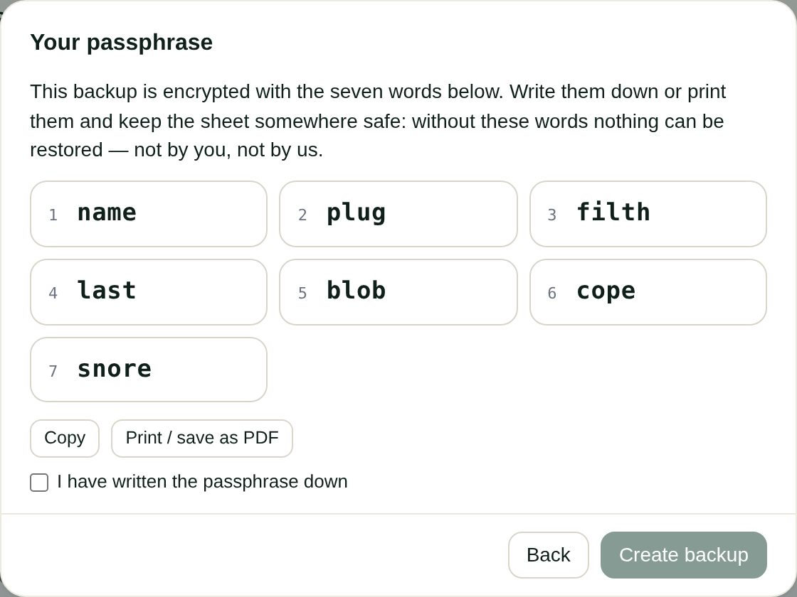
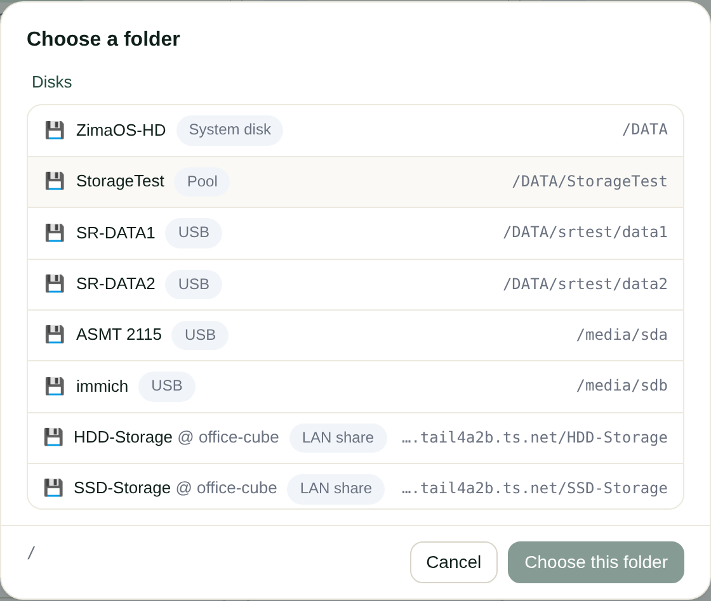
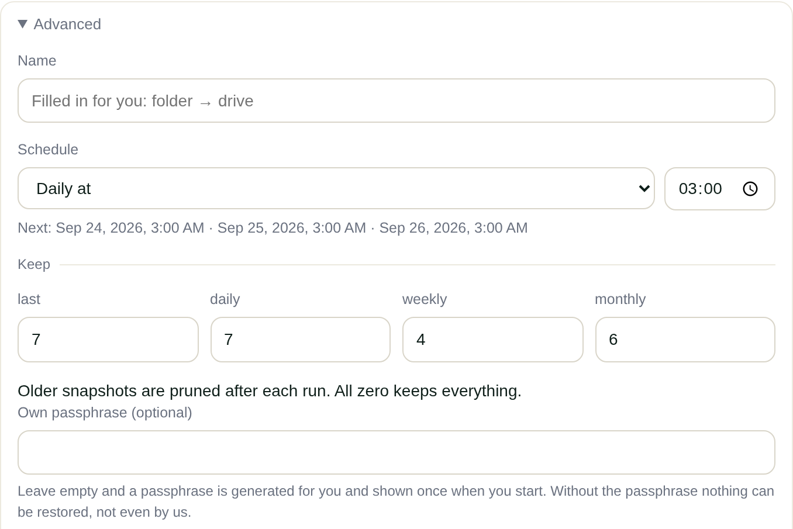
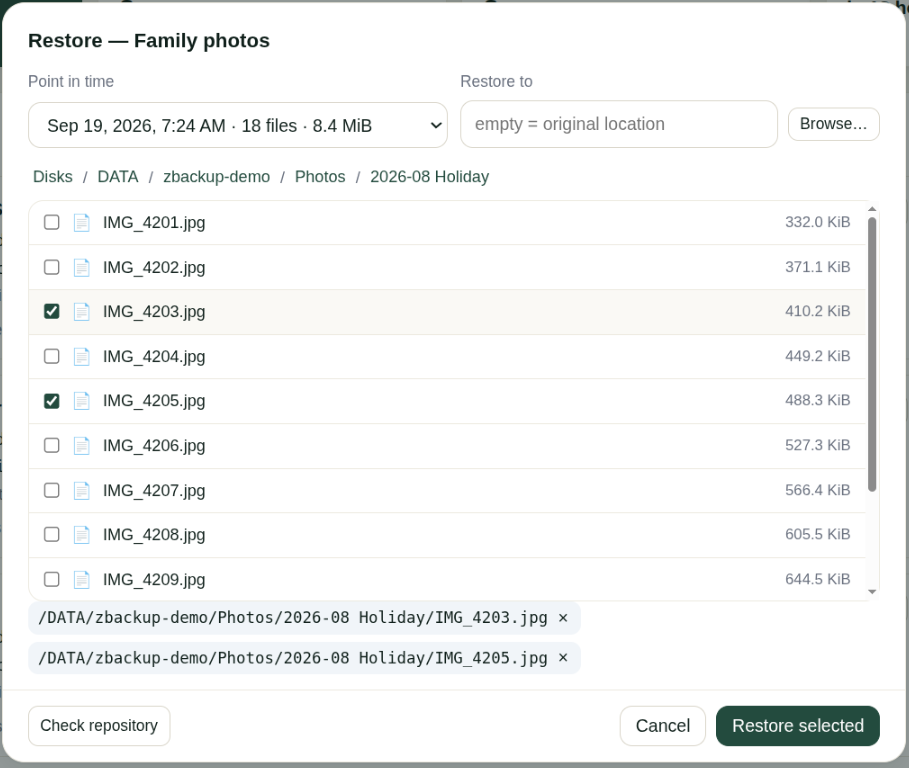
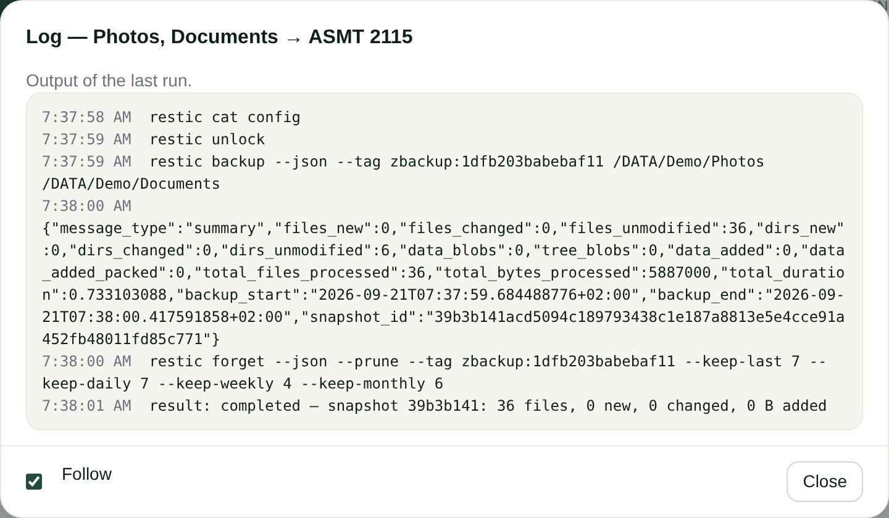
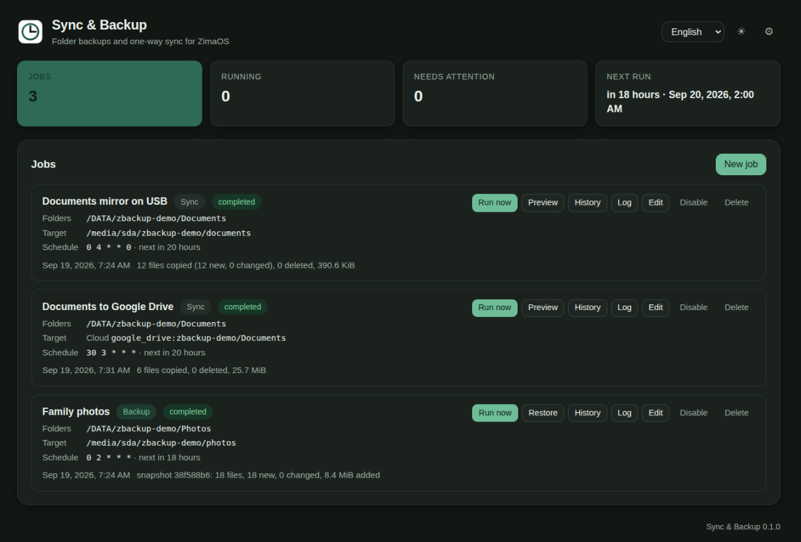

# Sync & Backup for ZimaOS

Folder backups with versions and restore, and one-way sync to a second disk,
another ZimaOS box or a server — as a ZimaOS module in the same family as
[ZFW](https://github.com/chicohaager/zfw) and [Cron](https://github.com/chicohaager/cron).

ZimaOS' own *Backup* tile backs up phones to the Zima; this module covers
the folders on the Zima itself. Both coexist.



## Your first backup in nine clicks

**New backup → Choose folder… → pick the folder → Choose this folder →
click a drive → Start → tick "I have written the passphrase down" →
Create backup.** Nothing to type: the name, the folder on the target, the
schedule (daily at 03:00), what to keep (7 days, 4 weeks, 6 months) and
the passphrase are filled in for you, and the first run starts right away.
Measured on ZimaOS 1.7.1: nine clicks, zero characters, first snapshot
written.

<table>
<tr>
<td></td>
<td></td>
</tr>
</table>

The one line above *Advanced* says what will happen — *Backup · daily at
03:00 · keeps 7 days, 4 weeks, 6 months · encrypted* — and *Advanced* is
where you change it: backup or sync, name, the schedule in words (daily
at, weekly on, monthly on day, every hour, every N minutes, cron for
experts), what to keep, your own passphrase, excludes, timeout,
notifications, and the direct targets for experts (SSH, SFTP, SMB, S3).

<table>
<tr>
<td></td>
<td></td>
</tr>
</table>

## Features

- **Backup** — encrypted, versioned snapshots with [restic](https://restic.net)
  (bundled): retention (last / daily / weekly / monthly), browse any point
  in time, restore single files or whole folders, check the repository.
- **System** — the Zima itself: `/etc` overlay, ZimaOS state, modules,
  AppData, with a manifest and consistent database copies; a guided
  restore puts a fresh install of the same ZimaOS version back to that
  point (see *Backing up the Zima itself*).
- **Sync** — a plain one-way mirror with rsync (local disk, SSH) or rclone
  (SFTP, SMB, S3, cloud). "Mirror deletions" is a switch, off by default;
  a preview shows what a run would copy and delete before it runs.
- **Targets by clicking** — the drives in the box (system disk, pools,
  USB disks, named by label or model, with free space), the network shares
  ZimaOS Files has connected, and the cloud drives Files is signed in to
  (Google Drive, OneDrive, …). One click sets the target; the folder on it
  is chosen for you (`Backups/<folder>`, one repository per job).
- **Network shares without a form** — *Connect a network share…* asks for
  the server (found on the LAN by name), guest or user and password, and
  hands it to ZimaOS Files, which mounts every share of that server. From
  then on the shares are drive cards here and folders in Files, and they
  come back after a reboot on their own.
- **A passphrase you can keep** — a backup without a passphrase of your own
  gets seven random words from the EFF short wordlist (1296 words,
  chosen with `crypto.getRandomValues`, about 72 bits), shown once, with
  *Copy* and *Print / save as PDF*, and a checkbox before the backup starts.
  Your own passphrase goes under *Advanced*.
- **Schedules in words** — *daily at 03:00*, *every Sunday at 03:00*,
  *monthly on day 1*, *every hour at minute 15*, *every 20 minutes*; the
  next three runs are shown while you choose, and the overview says *next
  in 19 hours*. A cron expression is still there for experts and stays
  visible as such.
- **Errors in words** — a wrong SMB password says *user or password
  refused* with the line rclone printed; a share that is not there says
  *share not found on the server*; a disconnected share or an unplugged
  disk says *the network share \\server\share is not connected — connect it
  in Files or with 'Connect a network share…'* / *the drive sdb is not
  mounted — is it plugged in?*; a folder that is empty at run time ends
  with a yellow *nothing to back up* instead of a green success.
- **Direct targets for experts** — another ZimaOS/Linux box over SSH with
  the module's own key, SFTP server, Windows/SMB share, S3-compatible
  storage; other ZimaOS boxes and Tailscale peers are found on the network
  by name.
- **Notifications** — Telegram, or a webhook in generic JSON, n8n,
  Discord, Slack, Home Assistant or Uptime Kuma format.
- **Ergonomics** — one screen (what · where · start), folder chips with
  file count and size, job rows *from → to · kind · schedule · next · last
  result*, live progress with phase, transfer rate and — on cloud drives —
  files per second, a *Log* window with the tool's own output, history;
  English, German, French, Spanish and Chinese, following the ZimaOS shell language;
  light and dark; the session renews itself.
- **Safety** — an unplugged disk is refused instead of filling the system
  disk, exFAT/FAT disks work without ownership errors, two backup jobs
  cannot share one repository, a probe of the target is bounded (90 s)
  and a stuck tool is killed with its children, secrets never leave
  `keys/` (mode 600) and never appear in an API response.

## Backing up the Zima itself

ZimaOS is an appliance: the operating system is a pair of read-only
squashfs slots identical to the release image (measured on 1.7.1, see
`PLAN-0.3.md` §1). What makes a box *yours* is small and lives in three
places — the `/etc` overlay (about 330 KB: network, users, hostname, SSH
host keys), the ZimaOS state (`/var/lib/casaos`, `/var/lib/icewhale`:
apps, users, app store, file service) and the installed modules — plus
`/DATA/AppData`. A **System** backup takes exactly that, with a manifest
(ZimaOS version, RAUC slots, partition table, Docker image digests, app
and module names; no secrets) and consistent copies of the six SQLite
databases. Docker images are not included; they are pulled again.

*New backup → Advanced → System → pick a drive → Start.* Measured on a
box with 19 apps: 85.8 GiB in 315 s to the system disk, the second run
8 MiB in 10 s. *Also my files* under Advanced adds the whole `/DATA`.

**Restore** (*Restore system* on the row) reads the manifest, shows the
version, hostname, apps and databases of the snapshot, refuses another
ZimaOS version unless you tick the box, and wants the word RESTORE. It
then stops the ZimaOS services and every container, writes `/etc` back
through the overlay (files the running box has and the snapshot lacks
fall back to the read-only root's copy), replaces the state directories
and AppData (`rsync --delete`; the module's own folder and image are kept),
checks every database (`PRAGMA integrity_check`), starts every container
that was running again — on this box they still exist, so nothing is
re-created and no compose file or environment is re-read — and asks for a
reboot. Measured on 1.7.1 with 22 compose projects and 41 containers:
about 10 minutes restic, one minute apply, `41 started, 0 failed`; after
the reboot the same 41 containers, the same tiles, databases `ok`.

**Bare metal**: install the same ZimaOS version from IceWhale's installer,
install this module, add the drive with the repository and the passphrase
(*New backup → Advanced → System*, same target, own passphrase), then
*Restore system*. A box with no containers yet brings every app up from its
compose file, which is what puts the tiles back. Measured end to end on a
fresh ZimaOS 1.7.1 in a VM: an app, its tile and its data in `/DATA/AppData`
were gone, the restore took 30 s (`fresh box: apps started from casaos/apps:
1, failed: 0`), and after the reboot the tile, the app (HTTP 200) and its
data file were back. Sessions are invalidated by the restore — sign in again.

## Installation

Requires ZimaOS 1.7.x on amd64 or arm64.

Download `zbackup-amd64.raw` (or `zbackup-arm64.raw`) from the
[releases](https://github.com/chicohaager/zima-backup/releases), copy it to
the host **as `zbackup.raw`** and run

```sh
sudo zpkg install /tmp/zbackup.raw
```

`zpkg` accepts the image only under the name that matches
`extension-release.zbackup` inside it; any other file name is refused
with "module not pass validate" (measured on ZimaOS 1.7.1). The service
starts by itself and appears as **Sync & Backup** on the dashboard.

Upgrade: `sudo zpkg remove zbackup && sudo zpkg install /tmp/zbackup.raw`
— jobs, secrets and history under `/DATA/AppData/zbackup` are kept.
Jobs made with 0.1 keep working; their cron expressions are shown in
words where the words fit, and as the expression where they do not.

## Usage

1. **New backup**, then **Choose folder…** for every folder to protect.
   Each folder shows how many files and how much data it holds.
2. Click the drive, share or cloud drive it should go to. The folder on
   it is filled in (`Backups/<folder>`); change it if you like. A share
   that is not listed yet: **Connect a network share…**.
3. **Start.** A backup shows its seven-word passphrase once — write it
   down or print it, tick the box, **Create backup** — and runs right
   away. A sync opens its preview instead.

*Advanced* holds everything else: sync instead of backup, name, schedule,
retention, own passphrase, excludes, timeout, notifications, and the
direct targets for experts. For SSH/SFTP the module shows its public key;
paste it into `~/.ssh/authorized_keys` of the user on the target.

**Restore** on a backup row lists the snapshots; pick files or folders in
the tree and restore them to the original place or to another folder.
**Check repository** verifies the repository structure. The **···** menu
has **History** (every run with its result), **Log** (the commands and
output of the last run), **Edit**, **Disable** and **Delete**.

<table>
<tr>
<td></td>
<td></td>
</tr>
</table>

The UI follows the ZimaOS language (English, German, French, Spanish, Chinese) and
has a light and a dark theme.



## Network shares through Files

ZimaOS Files connects a server (`POST /v2_1/files/connect` with host,
user and password — guest is user `guest` with an empty password) and
mounts **every** share of that server as CIFS under `/media/<host>/<share>`,
root-owned, so the module (which runs as root) can write there. The
module lists those mounts as *LAN share* cards, and *Connect a network
share…* calls the same endpoint with the session the UI already has.
Measured on 1.7.1: the connection survives a reboot (Files reconnects
about 20 s after boot, in the same second the module starts); a share
that is disconnected while a job points at it fails with
`target_unavailable` and the sentence naming the share, and the job runs
again once the share is back. restic on CIFS: a small backup completed in
6 s, `check` passed, a second run added 0 B.
A share works as a **source** too (measured on 1.7.1, module 0.2.1): a folder
on a CIFS share of another box — six files, 1 000 006 bytes — backed up in one
run (`6 files, 6 new`), a second run added 0 B, and a restore to `/DATA`
matched the originals on the share byte for byte (`sha256sum -c`, 6/6 OK).
So a computer's *shared folders* can be backed up this way; a bare-metal
image of a computer (partitions, bootloader) is not what this module does —
its backups are file-level restic snapshots.

## How sync lays out the target

Each source folder is mirrored to `<target>/<basename of source>`, so
`/DATA/Photos` and `/DATA/Documents` synced to `/media/usb1/mirror` become
`/media/usb1/mirror/Photos` and `/media/usb1/mirror/Documents`. With
"mirror deletions" on, only files inside those folders that no longer
exist in the source are removed; anything else on the target is left
alone. Two sources with the same folder name are refused
(`source_name_conflict`), and a target inside a source (or the other way
round) is refused (`target_nested`).

## Disks without ownership (exFAT, FAT, NTFS)

Before an rsync the module probes the target folder: if the filesystem
refuses `chown`, ownership and permissions are not synced (otherwise
every run would end with rsync exit 23 — measured on an exFAT USB disk);
if it rounds timestamps, a 2 s window is used. A restore onto such a disk
writes all data and reports that ownership could not be set.

## Local targets and unplugged disks

A local target must lie on a filesystem mounted below `/media` or `/mnt`
(or on `/DATA`): `/media/sdb/backups` is accepted while the disk is
mounted and refused when `/media/sdb` is just an empty folder on the
system disk — a backup must never silently land there.

## Drives

`GET /api/mounts` reads `/proc/self/mounts` and sysfs: `/DATA` is the
system disk, `fuse.mergerfs` under `/DATA` a pool, block devices under
`/media`, `/mnt` or `/DATA` a disk (USB when its sysfs path runs through
a USB bus; named by filesystem label, else vendor and model), `cifs` or
`smb3` under `/media/<host>/<share>` a LAN share connected through Files
(named by share and host), `fuse.rclone` under `/media` a cloud drive
(named by the provider ZimaOS encodes in the remote name). Other
partitions of the system disk, docker overlays and a disk's second bind
mount are left out. Measured on 1.7.1 with two USB disks, a SnapRAID test
disk, a mergerfs pool, seven shares from two servers, Google Drive and
OneDrive.

## Cloud drives

The cloud drives ZimaOS Files is signed in to (Google Drive, OneDrive, …)
are a target of their own: the module reads the remote from ZimaOS' own
rclone configuration and talks to the drive directly — restic through
its rclone backend, sync through rclone — never through the mounted
folder under `/media`, which is refused as a target (`cloud_mount`).
Measured on 1.7.1 against Google Drive: the mounted folder needed more
than ten minutes just to create restic's 256 data folders and 52 s per
small file; the direct path creates the repository in 14–46 s, uploads
a large file at 3.2 MiB/s, and backs up at about 0.35 MB/s (restic packs
the data, so many small files cost little). What stays slow is one round
trip per file the drive insists on — 78 small files took eight minutes
as a plain sync. The first backup of a large folder is therefore an
overnight job; later runs only send changes (measured: 23–59 s when
nothing changed).

The cards in the target step show the cloud drives next to the disks;
picking one switches the target to *Cloud drive*.

## Finding other machines

*Find on the network* in the target step listens for two seconds:

| Source | How | What it needs |
|---|---|---|
| ZimaOS boxes on the LAN | mDNS query for `_zimaos._tcp` — every ZimaOS box announces itself with `os=ZimaOS` | nothing |
| ZimaOS boxes over ZeroTier | the same query; ZimaOS' ZeroTier network subscribes to mDNS multicast (measured on 1.7.1) | the other box on the same ZeroTier network |
| Tailscale peers | `tailscale status --json` — online peers with a DNS name; Tailscale's own funnel nodes are skipped | Tailscale from a sysext (the App-Store container keeps its socket inside the container, so the module cannot see it) |
| ZimaNet | not measured yet: ZimaNet (`znet`) has no peer list locally; whether mDNS crosses its tunnel needs a second box | — |

The network each host is reached through (LAN, ZeroTier, ZimaNet,
Tailscale) is read from the local routes and shown next to the name.
Picking a host only fills in the address — the target still needs a user,
a folder, and for SSH the module's public key in its `authorized_keys`
(SSH is off by default on ZimaOS; enable it on the other box).

## Sessions

The module renews the ZimaOS session itself: the shell's access token
lives three hours, on 401 the UI calls the shell's own refresh endpoint
once and retries, so a page left open overnight keeps working.

## Verified

`test_deployment.sh` runs 27 end-to-end checks against a box (auth,
validation, backup → restore → check, sync with preview, wrong passphrase,
unplugged disk). It passed on ZimaOS 1.7.1 against `/DATA`, a mergerfs
pool, an ext4 USB disk and an exFAT USB disk, again after a reboot, and
again with 0.2 (27/27 on 2026-09-21). Cross-host targets (rsync over ssh,
restic over sftp, rclone over sftp) were verified against a Linux box
with the module's own key; SMB backup and sync against a Samba share, as
an expert target and as a share connected through Files; restored files
compared by sha256. The stderr of a wrong SMB password, a missing share
and a repository the server cannot serve are unit-test fixtures
(`internal/backup/explain_test.go`), recorded from real runs.

## systemd integration

`zbackup.raw` is a systemd-sysext image. It contributes:

| Path | Purpose |
|---|---|
| `/usr/bin/zbackupd` | the daemon |
| `/usr/libexec/zbackup/restic` | restic 0.19.1, fetched at build time and checksum-verified |
| `/usr/lib/systemd/system/zbackup.service` | ordered after `zimaos-gateway`, `zimaos-message-bus`, `zimaos-user`; `RequiresMountsFor=/DATA/AppData`; `Restart=always` |
| `/usr/share/casaos/modules/zbackup.json` | dashboard tile |
| `/usr/share/casaos/www/modules/zbackup/` | the UI, served by the ZimaOS gateway |

On ZimaOS, units inside a sysext are not scheduled at boot: `multi-user.target`
is resolved before the extension is merged into `/usr`. The daemon therefore
writes two small units to the persistent `/etc/systemd/system/` on first
start: `zbackup-watchdog.timer` (`OnBootSec=15`) starts the service if it
is not active after boot, `zbackup-refresh.path` restarts it when the
binary changes (module upgrade without reboot). Measured after a reboot
of a 1.7.1 box: the watchdog started the service 22 s after boot, the
gateway route was registered in the same second.

rsync and rclone come from the ZimaOS base image (measured on 1.7.1:
rsync 3.4.1, rclone v1.74.3-adrive.4).

## Data

```
/DATA/AppData/zbackup/
  jobs.json         job definitions and last result — never a secret
  keys/<id>.json    passphrase and target password of one job (mode 600)
  keys/             the module's ssh key pair (ed25519), its known_hosts
  logs/<id>.json    run history of one job
  settings.json     Telegram settings
  cache/            restic cache
```

## Building

```sh
./build.sh amd64      # or arm64 — produces zbackup-<arch>.raw + .sha256
go test -race ./...   # RCLONE_BIN=<path to rclone> for the rclone tests
tools/check-i18n.py   # every key in every language
ZIMA_USER=… ZIMA_PASS=… ./test_deployment.sh http://<host> [target-dir]
```

`build.sh` fetches restic for the target architecture and verifies it
against the release's `SHA256SUMS`; `tools/fetch-rclone.sh` fetches rclone
for the tests only. The Go module currently vendors
[lintux-modkit](https://github.com/chicohaager/lintux-modkit) through a
`replace` directive until it is published.

## API

All routes sit under `/v2/zbackup/api` behind the ZimaOS session
(`Authorization: Bearer <access_token>`), except `GET /api/health`.
Errors are JSON `{"code": "...", "error": "..."}` with stable codes (see
`internal/api/api.go`). Jobs: `GET/POST /api/jobs`,
`GET/PUT/DELETE /api/jobs/{id}`, `POST …/run|cancel|enable|disable`,
`GET …/logs`, `POST …/logs/clear`; backup: `GET …/snapshots`,
`GET …/snapshots/{snap}/ls?path=`, `POST …/restore`, `POST …/check`;
sync: `POST …/preview`; `GET …/output` (kept lines of the current or
last run, with phase); plus `GET /api/folders?path=`,
`GET/PUT /api/settings`, `POST /api/schedule/validate`, `GET /api/sshkey`.

## Contributing

Issues and pull requests are welcome. The French and Spanish translations
were drafted by a non-native speaker — corrections are especially welcome.

## License

MIT — see `LICENSE`.

## ☕ Support

If this project saves you time, you can buy me a coffee — it keeps the side projects going.

<!-- bmc-button -->
[](https://buymeacoffee.com/holgi18114)

… or scan the code:

<a href="https://buymeacoffee.com/holgi18114"></a>
